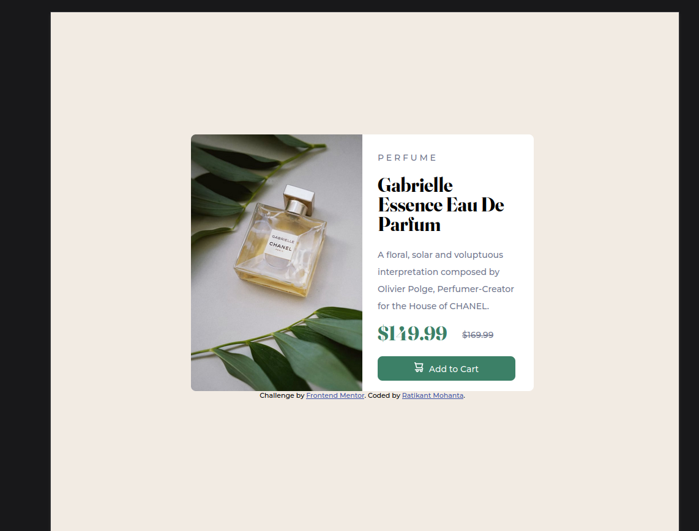
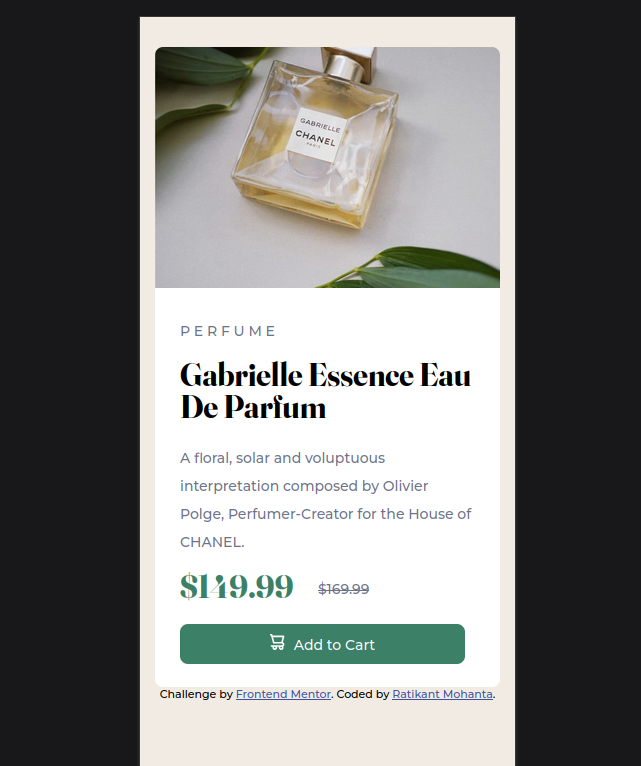

# Frontend Mentor - Product preview card component solution

This is a solution to the [Product preview card component challenge on Frontend Mentor](https://www.frontendmentor.io/challenges/product-preview-card-component-GO7UmttRfa). Frontend Mentor challenges help you improve your coding skills by building realistic projects.

## Table of contents

- [Overview](#overview)
  - [The challenge](#the-challenge)
  - [Screenshot](#screenshot)
  - [Links](#links)
- [My process](#my-process)
  - [Built with](#built-with)
  - [What I learned](#what-i-learned)
  - [Continued development](#continued-development)
  - [Useful resources](#useful-resources)
- [Author](#author)
- [Acknowledgments](#acknowledgments)

*******************************************************************************************************************************************************************************************************
*******************************************************************************************************************************************************************************************************

## Overview

### The challenge

Users should be able to:

- View the optimal layout depending on their device's screen size

### Screenshot

### Links

- Solution URL: [Add solution URL here](https://your-solution-url.com)
- Live Site URL: [Add live site URL here](https://your-live-site-url.com)

## My process

### Built with

- Semantic HTML5 markup
- CSS custom properties

### What I learned

Use this section to recap over some of your major learnings while working through this project. Writing these out and providing code samples of areas you want to highlight is a great way to reinforce your own knowledge.

To see how you can add code snippets, see below:

    @media (max-width: 375px) {
    .container {
        border-radius: 8px;
        margin: 30px auto auto auto;
        width: 345px;
        height: 640px;
    }

    .container-in {
        padding-left: 25px;
    }

    .image-class {
        display: none;
    }

    .image-class2 {
        position: relative;
        visibility: visible;
        border-top-left-radius: 8px;
        border-top-right-radius: 8px;
        width: 100%;
    }

    .btn {
        padding: 10px 90px 10px 90px;
    }

    }

### Continued development

-Need to improve my documentation.
-Code Optimization.

### Useful resources

- [1](https://balsamiq.cloud) - This helped me for wireframing.
- [2](https://css3buttongenerator.com/) - This helped me in designing the button.
- [3](https://fonts.google.com) - Selecting desired Fonts.

## Author

- Website - [Ratikant Mohanta](https://www.your-site.com)
- Frontend Mentor - [@ratikantmohanta](https://www.frontendmentor.io/profile/ratikantmohanta)
- GitHub - [@ratikantmohanta](https://github.com/ratikantmohanta)

## Acknowledgments

Was recomended to frontendmentor.io by
Dr. Angela Yu(<https://www.udemy.com/user/4b4368a3-b5c8-4529-aa65-2056ec31f37e/>)
